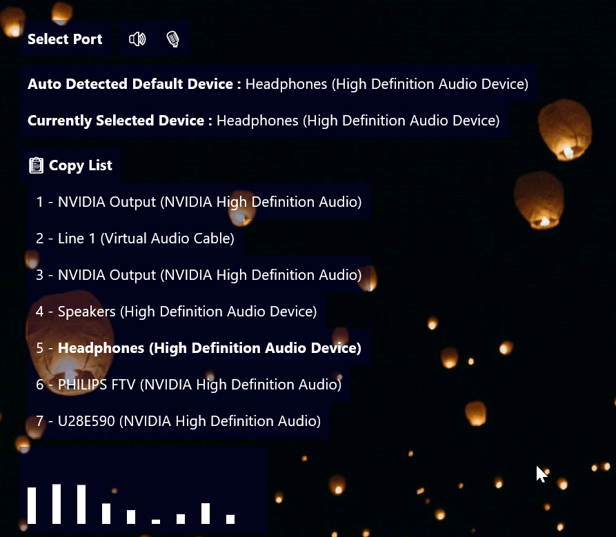

# ALICK (AudioLevel ID Copy Kapoosh)
*All you need is ALICK (AudioLevel ID Copy Kapoosh) to get to the core of AudioLevel.*

A simple utility skin that helps you get the audio device ID (and even test if it's supported). For use for those who want to get/set a specific audio device to be recorded by visualizers. Just click on a device to copy its ID.

# Installation
**Get the latest .rmskin from the [Releases](https://github.com/Drgabi18/ALICK/releases) tab**

# How do I use this?
Click a device to copy its ID. You can get both a speaker and microphone's ID. Remember that if you're gonna use these you'll need `Port` on the correct value of what you wanna record (so `Port=Output` and `ID` of a Speaker).
If an audio device is not supported, it will give out an error, pretty handy I guess.

# Shortcomings
* The list of devices is only initalized when the skin is loaded, so if you're gonna add multiple devices, you'll need to refresh the skin, I could maybe fix this by making the LUA function work on `Update()` instead of `Initialize()`.
* It can't magically fix unsupported devices.

# Version History
* (6 Octomber 2023) **Release Candidate 1**
  - Initial release

# License
`CC BY-NC-SA 4.0 | Do not republish my work to profit off it`
